# <h1 style="text-align: center;">**Holodeck**</h1>

## What is Holodeck?

<div style="flex: 1; display: flex; align-items: center; justify-content: center">
    <iframe width="560" height="315" src="https://www.youtube.com/embed/NaAquL2U88E?si=3XdV_kiCy31tZErG" title="YouTube video player" frameborder="0" allow="accelerometer; autoplay; clipboard-write; encrypted-media; gyroscope; picture-in-picture; web-share" referrerpolicy="strict-origin-when-cross-origin" allowfullscreen></iframe>
</div>


Holodeck is a toolkit designed to provide a standardized and automated method to deploy nested VMware Cloud
Foundation (VCF) environments on a VMware ESX host or a vSphere cluster. These environments are ideal for technical capability testing by
multiple teams inside a data center to explore hands-on exercises showcasing VCF capabilities to deliver a customer managed
VMware Private Cloud. Holodeck is **only** to be used for a testing and training environment; it is ideal for anyone
wanting to gain a better understanding of how VCF functions across many use cases and capabilities. Currently, there are
two different versions of the Holodeck supported - Holodeck 5.2x supporting VCF 5.2.x and Holodeck 9.0 supporting VCF 5.2.x and VCF 9.0.x. 
    
This documentation solely focuses on Holodeck 9.0. If you need details on the previous version of Holodeck, please refer to this <a href="https://www.vmware.com/docs/vmw-vcf-holodeck-v52-setup" target="_blank">documentation</a>

<figure markdown="span">
    
</figure>

## Advantages of Holodeck

While there are multiple ways to deploy nested VCF environments, this can be time consuming and may require specific settings to ensure optimal experience.
That's where Holodeck comes in. Some of the challenges Holodeck helps overcome are:

- **Reduced hardware requirements**: When operating in a physical environment, VCF requires four vSAN Ready Nodes for the
management domain, and additional hosts for adding clusters or workload domains. In a nested environment, this same four
to eight hosts are easily virtualized to run on a single ESX host or a vSphere cluster.

- **Self-contained services**: Holodeck comes with built-in common infrastructure services, such as NTP, DNS, AD,
Certificate Services and DHCP within the environment, removing the need to rely on data center provided services during
testing. Each environment needs a single external IP.

- **Isolated networking**: Holodeck removes the need for VLAN and BGP connections in the customer network early in the testing phase.

- **Isolation between environments**: Each Holodeck deployment is completely self-contained. This avoids conflicts with existing
network configurations and allows for the deployment of multiple nested environments with no concerns for overlap.

- **Multiple VCF deployments on a single VMware ESX host of sufficient capacity**: A typical VCF Standard Architecture
deployment of four node management domain and three node VI workload domain requires approximately 24 CPU cores, 325GB memory and 1.1TB disk for VCF 9.0.

- **Automation and repeatability**: The deployment of a nested VCF environments is almost completely hands-off, and easily repeatable.

## Holodeck Environment Overview

Each Holodeck environment contains:

=== "VCF 9.0"

    - A Holorouter appliance (photon OS based) with built-in networking services such as DNS, DHCP, NTP, Proxy, dynamic routing (BGP), L2 switching and optional webtop (virtual desktop) capability
    - Support for VCF and VVF deployments
    - vSAN ESA and OSA support
    - Support for online and offline depot with proxy for VCF Installer
    - Management Domain deployed with 4 nested hosts deployed as vSAN ready nodes including VCF Installer, VMware vCenter, VMware NSX, VCF Operations, VMware SDDC Manager, VCF Automation (optional)
    - Optional Workload Domain deployed with 3 nested hosts deployed as vSAN ready nodes including VMware vCenter, VMware NSX and Supervisor (optional)
    - Optional NSX Edge Cluster deployment in management and/or workload domain
    - Deploy one or many additional 3-node vSphere cluster in management domain
    - Support for provision-only mode (deploy VCF Installer and ESX hosts to allow greenfield deployment experience)
    - Custom CIDR support for Holodeck network
    - Custom VLAN support for Holodeck network
    - Custom DNS Domain for Holodeck environment

=== "VCF 5.2"

    - A Holorouter appliance (photon OS based) with built-in networking services such as DNS, DHCP, NTP, Proxy, dynamic routing (BGP), L2 switching and optional webtop (virtual desktop) capability
    - Support for VCF deployment only
    - vSAN OSA support only
    - Management Domain deployed with 4 nested hosts deployed as vSAN ready nodes including VMware Cloud Builder, VMware vCenter, VMware NSX, VMware SDDC-Manager
    - Optional Workload Domain deployed with 3 nested hosts deployed as vSAN ready nodes including VMware vCenter and VMware NSX
    - Optional NSX Edge Cluster deployment in management and/or workload domain
    - Deploy one or many additional 3-node vSphere cluster in management domain
    - Custom CIDR support for Holodeck network
    - Custom VLAN support for Holodeck network
    - Custom DNS Domain for Holodeck environment
<!-- Removed ESA support in 5.2-->

Note: Holodeck 9.0 is not a VMware supported product, it is similar to a Fling.

Holodeck 9.0 supports nested VCF deployment for versions 5.2 and 9.0. This can be deployed either on a single stand-alone ESX host or a vSphere cluster based on resource availability. Please check the [Pre-requisites](#pre-requisites) section

!!! warning "Holodeck 9.0 Support Status"
    Holodeck 9.0 is not a VMware supported product; it is similar to a Fling. It is intended for testing and training environments.

<!-- Architecture Diagram placeholder -->

Holodeck 9.0 has been developed using PowerShell and VMware PowerCLI. We have bundled and packaged everything needed into a powershell module called
Holodeck. This powershell module is provided to you as an in-built functionality within the OVA we ship called Holorouter. 

Each Holodeck environment runs an identical nested configuration. A Holodeck environment can be deployed as a Single or
Dual site Configuration. Separation of the environments and between sites within an environment is handled at the 
VMware vSphere Standard Switch (vSS) or VMware vSphere Distributed Switch (vDS) level. Each Holodeck pod is configured with a unique
port group on the vSS/vDS per site. A VMware vSphere Port Group is configured on each vSS/vDS and configured as a VLAN trunk to facilitate communication.
Components on the port group use VLAN tagging to isolate communications between nested VLANs. This removes the
need to have physical VLANs plumbed to the ESX host to support nested labs. There is also an option to use an NSX overlay segment instead of a vSS/vDS
port group if available.

### Holorouter Overview

HoloRouter is an appliance that serves as the infrastructure backbone for Holodeck. It provides infrastructure services such as Layer-3 routing, Firewall, DHCP, DNS, NTP, BGP, Proxy, Job scheduling, etc. Through these services, HoloRouter connects the nested VCF environment to the external networks. It also provides inter-connectivity between different networks in the nested VCF environment. If you are not using custom VLANs for Holodeck, then for Site-a, VLANs 0, 10 through 25 and for Site-b, VLANs 40 through 58 are used. It is equipped with a built-in webtop (Desktop UI) which allows users access to HoloRouter via a GUI. Through the webtop service, users get easy GUI access to the nested VCF environment. 

Scope of Services:
- DNS: local to Site-a and Site-b of nested VCF environment, acts as forwarder
- DHCP: local to Site-a and Site-b of nested VCF environment
- NTP: local to Site-a and Site-b of nested VCF environment
- L3 routing between VLANs of Site-a and Site-b of nested VCF environment
- Firewall to control traffic to and from external networks and between the networks in the nested VCF environment
- BGP: to establish relationship with NSX Tier-0 gateway for outbound connectivity for overlay networks
- Proxy: allows users to control the outbound connectivity for the nested VCF environment
- Job scheduling: allows users to schedule commands/scripts to be run recursively
- Webtop: allows users to access HoloRouter and nested VCF environment via a simple GUI
- Powershell with VMware PowerCLI and other associated modules: allows users to consume Holodeck 
- All required packages to deploy and operate Holodeck

### Concepts

- **Centralized Configuration:** Holodeck 9.0 has been designed around the concept of a centralized config file that acts as the source of truth for nested VCF deployments. The config file is a JSON file with a set of templates that are needed to run Holodeck. Customers are not expected to interact with the config file directly or edit it. We have built powershell cmdlets that help create, edit or import the config file as needed. The default template for config file is stored in /holodeck-runtime/templates/config.json. This config.json file is replicated and placed in /holodeck-runtime/config/<config-ID\>.json when a new holodeck config is created using the cmdlet New-HoloDeckConfig.

- **Idempotency:** We know that deploying an entire full stack SDDC deployment can be time consuming. We also know that this time can increase even further when performing nested deployments. We've all been in a situation where we reach towards the end of the deployment only to realize we missed something minor that causes deployment failure and we have to start all over again. To solve this challenge, we've brought in the idempotency feature in Holodeck 9.0. We store the state of the holodeck deployment on Holorouter thus allowing users to run the same command used to deploy Holodeck and pick up right where the code failed, eliminating the need to restart entire deployment or proceed manually in case of failure.

- **Automated Networking:** Assigning VLANs, IP addresses, routes etc for each of your deployments can seem like a daunting task. We take this pain away in Holodeck 9.0. We use a default CIDR (10.1.0.0/20) and build out the entire networking including DNS mapping for each of your nested hosts and VCF components, entire routing including BGP setup for NSX Edge peering. For end users looking to deploy Holodeck in a custom CIDR, we provide the option to bring in your own CIDR of /20 size as an input parameter and we automatically use that to deploy VCF in the CIDR you provide. End users also get an option to specify their own VLANs and DNS domain for the Holodeck environment. Holodeck uses vcf.lab as the default DNS domain but users can specify a custom DNS domain during deployment. 

- **Built-In PreChecks:** Holodeck 9.0 runs a set of pre-checks when a new deployment is run to ensure everything needed is available such as all the required binaries are available in the right location or not, is the target host reachable etc.

### Holodeck Networking

Let's take a look at the default VLANs used within the Holodeck Network for Site A:

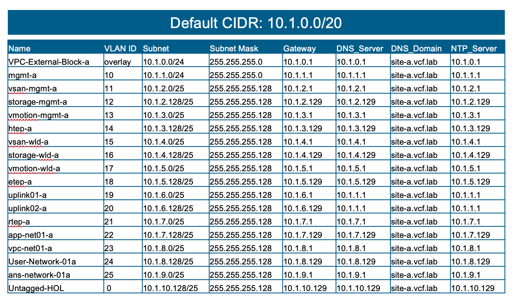

### Download the Required Software

Navigate to the [Downloads Page](downloads.md) to download Holodeck binaries.

## Pre-requisites

### Physical Host requirements

| VCF 5.2   | **Single Site**   | **Dual Site** |
|---        |---                |---            |
| CPU       | 16                | 32            |
| Memory    | 384 GB            | 1TB           |
| Disk      | 2 TB              | 4TB           |

If deploying VCF Automation with vSAN ESA:

| VCF 9.0   | **Single Site**   | **Dual Site** |
|---        |---                |---            |
| CPU       | 32                | 64            |
| Memory    | 325 GB            | 768 GB        |
| Disk      | 1.1 TB            | 2.5TB         |

If deploying VCF Automation with vSAN OSA:

| VCF 9.0   | **Single Site**   | **Dual Site** |
|---        |---                |---            |
| CPU       | 24                | 48            |
| Memory    | 325 GB            | 768 GB        |
| Disk      | 1.1 TB            | 2.5TB         |

| VVF 9.0   | **Single Site**   | **Dual Site** |
|---        |---                |---            |
| CPU       | 12                | 24            |
| Memory    | 256 GB            | 512 GB        |
| Disk      | 1 TB              | 2TB           |


### Configuration requirements

<ol>
    <li>
        Create a dedicated trunk port on the vSwitch (vSS) or vDS for connecting to Holorouter. Dedicated port group ensures Holodeck does not interfere with your environment's networking. An NSX overlay trunk port group can be used instead as well.
    </li>
    <li>
        If vSS/vDS port group is used, enable security settings on the trunk port group as below:<br>
        <figure markdown="span">
            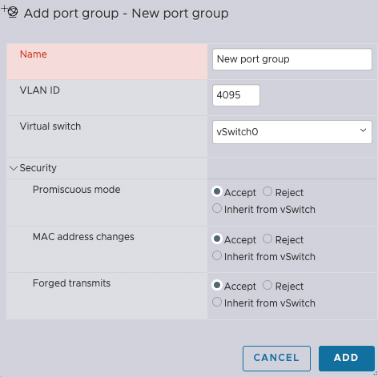
            <figcaption>Figure: Security Settings for vSS Port Group</figcaption>
            <br>
            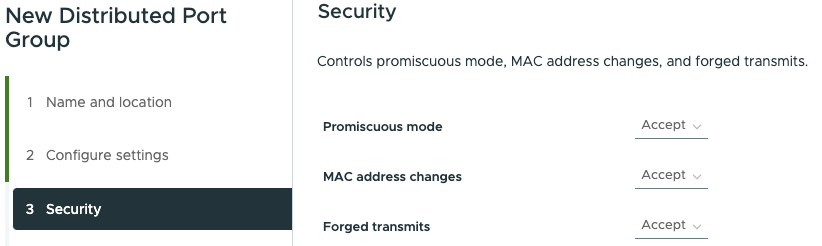
            <figcaption>Figure: Security Settings for vDS Port Group</figcaption>
        </figure>
    </li>
    <li>
        If NSX port group is used, ensure the type is Overlay and allow VLANs 0 to 4094 (or if using default VLANs, at a minimum VLANs 0,10-25 for Site A and 40-58 for Site-B; if using custom VLANs, VLAN 0 and custom VLAN range). Create custom segment profiles with settings as per below by navigating to Networking --> Segments tab on the left navigation bar, then click on Profiles tab on the right, click on Add segment profile and select the profiles as per below
        <figure markdown="span">
            
            <figcaption>Figure: IP Discovery Profile in NSX</figcaption>
            <br>
            
            <figcaption>Figure: MAC Discovery Profile in NSX</figcaption>
            <br>
            
            <figcaption>Figure: Segment Security Profile in NSX</figcaption>
        </figure>
        Once the profiles have been created, navigate to the overlay segment you wish to use and edit the segment and update the segment profiles association. 
    </li>
    <li>
        If a vCenter is used as the target for deploying nested VCF lab, then VLANs 0, 10 through 25 and 40 through 58 (or VLAN 0 and custom VLAN range as specified by the user) need to be allowed on the physical switches to allow inter-host communication within the vSphere cluster where the nested VCF deployment will occur.
    </li>
</ol>

### Target Host Configuration

- Version vSphere 8.0u3 and 9.0 have been tested and are supported
- Stand-alone non vCenter Server managed host or a vSphere cluster managed by a VMware vCenter server instance
- Virtual Standard switch and port groups configured per guidelines
- External/Customer networks required
- ESX host management IP (one per host)
- 4 CPU, 4 GB RAM and 75 GB storage for Holorouter (Internet access is optional)
- Backing storage should be SSD/NVMe based
- Holorouter external IP address per Holodeck Environment
- NTP service needs to be enabled and an NTP server must be configured. If using vCenter as the target, then all hosts within the vCenter cluster must have NTP running and configured.


### Licensing

Holodeck 9.0 only supports VCF 5.2.x and 9.0.x in "License Later" deployment mode. This mode enables all functionality for 90 days from the date of 
install for VCF 9.0 and for 60 days for VCF 5.2. After that time period expires, the environment will need to be redeployed, or license
must be added. Licensing is the responsibility of the end-user to ensure they procure the appropriate licenses by working with
their account teams.

## Deployment

### Prepare Physical ESX for Holodeck Networking

Each Holodeck environment requires an isolated (no uplinks) vSphere Standard Switch and corresponding Port Groups.

#### Pre-Requisites

External facing Port Group configured with an IP address available for each Holodeck environment to be deployed on this
host.

#### ESX Host Networking Configuration

This task describes the process for configuring a vSwitch called Holo-PG-A and a port group called Holo-PG-A

Note: Adding the second switch and port group for Site-2 is recommended even if you do not initially deploy the second site
within the pod.

#### Configure vSphere Standard Switches for Nested Networking

1. Create a standard switch called Holo-PG-A and MTU 8000.
2. Remove the uplink by clicking on the X on the uplink.
3. Verify the settings and click Add

#### Configure Holodeck Port Groups

1. Add a new Port Group
2. Name the Port Group Holo-PG-A
3. Set VLAN ID to 4095
4. Set virtual switch to Holo-PG-A
5. Open security and set all to accept
6. Click Add


### Deploy Holorouter OVA

Holodeck 9.0 supports deployments on both stand-alone ESX hosts as well as vCenter as target. Choose the appropriate tab below to follow the instructions for your specific target to deploy Holorouter.

=== "Stand-Alone ESX Host"

    <ol>
        <li>
            Log in to your target ESX host web interface "https://<IP or FQDN of your physical ESX host>"
        </li>
        <li>
            Right Click "Virtual Machines" and select "Create/Register VM"
            <figure markdown="span">
                
            </figure>
        </li>
        <li>
            In the modal window select "Deploy a virtual machine from OVF or OVA file"
            <figure markdown="span">
                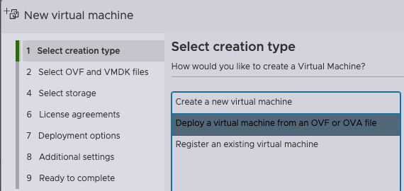
            </figure>
        </li>
        <li>
            Give the VM a name and select the Holorouter OVA you downloaded previously
            <figure markdown="span">
                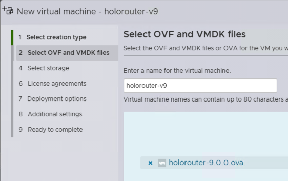
            </figure>
        </li>
        <li>
            Select the appropriate Storage and Networking where your Holodeck instance will be deployed. You will select an (External) port group for Management and then another (Trunk) for Site A and Site B - With the default Site configurations you can effectively use the same port group for both sites (They are on discrete VLANs and subnets).
            <figure markdown="span">
                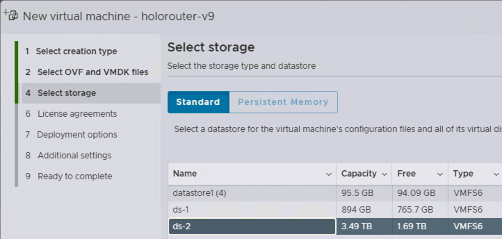
            </figure>
        </li>
        <li>
            Agree to the EULA
        </li>
        <li>
            To use DHCP leave the boxes blank, if your DHCP does not offer a DNS server, please fill that in. The other options is to statically assign a Management IP, CIDR, Gateway and DNS that will have access to the rest of your network, this IP can be used to access Holorouter and the components that will be deployed by Holodeck.
            <figure markdown="span">
                
            </figure>
        </li>
        <li>
            Select the checkboxes for SSH and/or Webtop
            <br>
            <b>NOTE</b> If Webtop is selected you'll have a "light" desktop with a browser available on port 30000 of the holorouter management IP. There is no authentication so be careful not to expose this externally, or do not select this option if you do not want it exposed.</b>
        </li>
        <li>
            Click Finish
        </li>
    </ol>

=== "vCenter"

    <ol>
        <li>
            Log in to your vCenter server https://<IP or FQDN of your physical ESX host>
        </li>
        <li>
            Right click your cluster and select "Deploy OVF Template"
            <figure markdown="span">
                
            </figure>
        </li>
        <li>
            Give the VM a name and select the Holorouter OVA you downloaded previously
            <figure markdown="span">
                
            </figure>
        </li>
        <li>
            Select the appropriate Storage and Networking where your Holodeck instance will be deployed. You will select an (External) port group for Management and then another (Trunk) for Site A and Site B - With the default Site configurations you can effectively use the same port group for both sites (They are on discrete VLANs and subnets).
            <figure markdown="span">
                
            </figure>
        </li>
        <li>
            To use DHCP leave the boxes blank, if your DHCP does not offer a DNS server, please fill that in. The other options is to statically assign a Management IP/CIDR/GW/DNS that will have access to the rest of your network, this IP can be used to access Holorouter and the components that will be deployed by Holodeck.
            <figure markdown="span">
                
            </figure>
        </li>
        <li>
            Select the checkboxes for SSH and/or Webtop
            <br>
            <b>NOTE</b> If Webtop is selected you'll have a "light" desktop with a browser available on port 30000 of the holorouter management IP. There is no authentication so be careful not to expose this externally, or do not select this option if you do not want it exposed.</b>
        </li>
        <li>
            Click Finish
        </li>
    </ol>

### Accessing Holodeck Environment

Users access to the Holodeck environment is via the Holorouter. Access to Holorouter is available via two paths:

- For UI access, open a web browser from a JumpHost or Console that has access to the external IP of Holorouter and navigate to the URL http://<Holorouter IP>:30000

- For CLI access, SSH to Holorouter using the command:

```
ssh root@<Holorouter IP>
```

Use the password that was set for Holorouter during OVA deployment.


### Stage software to build host

Upload the binaries for VCF Installer/Cloud Builder and VMware ESX that were downloaded in the Pre-requisites section to the below folder on holorouter:


| VCF Version | Folder Path                      |
|-------------|----------------------------------|
| VCF 9.0.1.0 | `/holodeck-runtime/bin/9.0.1.0/` |
| VCF 9.0.0.0 | `/holodeck-runtime/bin/9.0.0.0/` |
| VCF 5.2.2   | `/holodeck-runtime/bin/5.2.2/`   |
| VCF 5.2.1   | `/holodeck-runtime/bin/5.2.1/`   |
| VCF 5.2     | `/holodeck-runtime/bin/5.2/`     |

The files can be downloaded by accessing the Broadcom Support Portal within the webtop UI (assuming proper entitlement is available for end-user)

Another option is to download the files locally and use scp to copy the files using the below command:

For VCF 9.0.1.0:

```
scp /<local-path>/<ESX ISO File Name> root@<Holorouter-IP>:/holodeck-runtime/bin/9.0.1.0/
scp /<local-path>/<VCF Installer OVA File Name> root@<Holorouter-IP>:/holodeck-runtime/bin/9.0.1.0/
```

For VCF 9.0.0.0:

```
scp /<local-path>/<ESX ISO File Name> root@<Holorouter-IP>:/holodeck-runtime/bin/9.0.0.0/
scp /<local-path>/<VCF Installer OVA File Name> root@<Holorouter-IP>:/holodeck-runtime/bin/9.0.0.0/
```

!!! Note 
    VCF Installer 9.0.1.0 needs to be used for deploying VCF 9.0.0.0. VCF Installer 9.0.0.0 is no longer supported on Holodeck for nested VCF deployments.


For VCF 5.2.2:

```
scp /<local-path>/<ESX ISO File Name> root@<Holorouter-IP>:/holodeck-runtime/bin/5.2.2/
scp /<local-path>/<VCF Installer OVA File Name> root@<Holorouter-IP>:/holodeck-runtime/bin/5.2.2/
```

For VCF 5.2.1:

```
scp /<local-path>/<ESX ISO File Name> root@<Holorouter-IP>:/holodeck-runtime/bin/5.2.1/
scp /<local-path>/<VCF Installer OVA File Name> root@<Holorouter-IP>:/holodeck-runtime/bin/5.2.1/
```


For VCF 5.2:

```
scp /<local-path>/<ESX ISO File Name> root@<Holorouter-IP>:/holodeck-runtime/bin/5.2/
scp /<local-path>/<VCF Installer OVA File Name> root@<Holorouter-IP>:/holodeck-runtime/bin/5.2/
```

### Run Holodeck deployment

Once logged in to Holorouter via SSH or webtop (access the CLI inside webtop), run the following commands:

Open PowerShell:

```
pwsh
```

Use the command below to create a new Holodeck config. This command creates a config file specific for your deployment with a unique config ID and loads the config file into the $config variable. 

```New-HoloDeckConfig -Description <Description> -TargetHost <Target vCenter/ESX IP/FQDN> -Username <username> -Password <password>```


Multiple config files can be created by running the below command multiple times for different use-cases such as 1 config for VCF 5.2 deployment and another for VCF 9.0 deployment. 

To check which config is currently loaded in your powershell session, run the below command and check the config ID or description:

```
$config
```


Note that $config is specific to a powershell session. If you exit powershell and open a new session, you will need to import the config using:

```
Get-HoloDeckConfig
```

The above command gives a list of config files available. Note the config ID for your specific deployment to use in the below command.

```
Import-HoloDeckConfig -ConfigId <String>
```

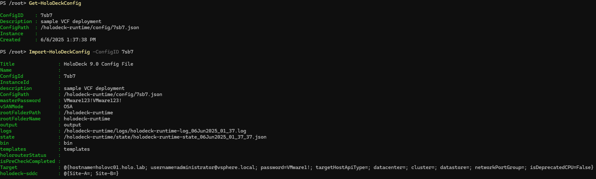

The same procedure can be followed if you wish to switch from one config file to another as well. 

Deploy a Holodeck instance using the New-HoloDeckInstance command. This command can be operated in 4 different ways as shown below:


If you notice closely, some of the parameters have a square bracket around them while others do not. The ones that have square brackets around them are optional parameters. With this information, let's look at each option in the Syntax section of the above image.

<hr>

#### **VVF Deployment**

```New-HoloDeckInstance -Version <String> [-InstanceID <String>] [-CIDR <String[]>] [-vSANMode <String>] [-LogLevel <String>] [-ProvisionOnly] [-VLANRangeStart <Int32[]>] [-DNSDomain <String>] -VVF [-Site <String>] [-DepotType <String>] [-DeveloperMode] [<CommonParameters>]```

In the first option, we see that -VVF and -Version are mandatory, showcasing this syntax is used for VVF deployment. 

Note: VVF deployment is supported only when -Version is selected as "9.0.0.0" and beyond. Using -Version "5.2" with -VVF yields no result.
<hr>

#### **Management-Domain Only Deployment**

```New-HoloDeckInstance -Version <String> [-InstanceID <String>] [-CIDR <String[]>] [-vSANMode <String>] -ManagementOnly [-NsxEdgeClusterMgmtDomain] [-DeployVcfAutomation] [-LogLevel <String>] [-ProvisionOnly] [-VLANRangeStart <Int32[]>] [-DNSDomain <String>] [-Site <String>] [-DepotType <String>] [-DeveloperMode] [<CommonParameters>]```

In the second option, we see that -ManagementOnly and -Version is mandatory, showcasing this syntax is used to deploy a nested VCF deployment with management domain only. 


| **Parameter**            | **Type** | **Required** | **Description**     |     **Options**                                         | **Default Value**          |
|--------------------------|----------|--------------|----------------------|-----------------------------------------|----------------------------|
| Version                  | String   | **Mandatory**| Provide VCF version | "9.0.0.0", "9.0.1.0", "5.2", "5.2.1" or "5.2.2"                                      |                            |
| InstanceID               | String   | Optional     | Optional Instance ID used as a prefix before all nested VMs deployed as part of Holodeck to help users uniquely identify their instances. If Instance ID is not provided, a random Instance ID is generated and used.     | String                                              |                            |
| CIDR                     | String   | Optional     | VCF instance is deployed by default in the 10.1.0.0/20 CIDR. If you wish to use a custom CIDR, provide a CIDR of /20 size     | String of format: "10.3.0.0/20"                     | "10.1.0.0/20"              |
| vSANMode                 | String   | Optional     | Support for both vSAN Express Storage Architecture (ESA) and Original Storage Architecture (OSA)     | "ESA" or "OSA"                                      | "OSA"                      |
| ManagementOnly           | Switch   | **Mandatory**|  Deploys a VCF instance with Management domain only    | NA                                                  |                            |
| NsxEdgeClusterMgmtDomain | Switch   | Optional     | Deploys an NSX Edge Cluster in Management domain (AVN included if deploying VCF 5.2)     | NA                                                  |                            |
| DeployVcfAutomation      | Switch   | Optional     | Deploys VCF Automation. This is applicable only if -Version is set to "9.0.0.0" and beyond. VCF Automation is not deployed by default unless this switch is used.     | NA                                                  |                            |
| ProvisionOnly            | Switch   | Optional     | Deploys nested ESX hosts and VCF Installer/Cloud Builder and provides JSON API specs for performing VCF deployment manually     | NA  |                      |
| VLANRangeStart                     | Array of Integers   | Optional     | VCF instance is deployed by default with VLANs 0, 10 through 25 for Site a and 40 through 58 for Site b. If you wish to use a custom VLAN range, provide the start of the custom VLAN range using this paramater. You can specify it only for a single site by just specifying the integer or for dual site using an array [n,m] where n and m are the VLAN start range for Site a and Site b respectively. The VLAN specified for Site a should have at least 16 consecutive valid VLAN IDs and for site b, it should have at least 19 consecutive valid VLAN IDs.     | Integer of format: [100,200]                     | [10,40]             |
| DNSDomain                     | String   | Optional     | VCF instance is deployed by default with DNS domain vcf.lab. The users can specify a custom DNS domain using the DNSDomain parameter.     | String of format: demo.lab                    | vcf.lab             |
| Site                     | String   | Optional     | Deploy site a or b in a VCF Instance | "a" or "b"  | "a"                      |
| DepotType                | String   | Optional     | Applicable for -Version 9.0.0.0 and beyond only. Choose whether VCF Installer should use the online or offline depot to download VCF 9 components. | "Online" or "Offline"  | "Online"                      |
| LogLevel                 | String   | Optional     | Set the log level you wish to view     | One of "INFO", "DEBUG", "SUCCESS", "WARN", "ERROR"  | "INFO"                     |
| DeveloperMode            | Switch   | Optional     | Enables automated deployments using environment variables. | NA  |                      |


<hr>

#### **Full Stack Deployment**

```New-HoloDeckInstance -Version <String> [-InstanceID <String>] [-CIDR <String[]>] [-vSANMode <String>] [-WorkloadDomainType <String>] [-NsxEdgeClusterMgmtDomain] [-NsxEdgeClusterWkldDomain] [-DeployVcfAutomation] [-DeploySupervisor] [-LogLevel <String>] [-ProvisionOnly] [-VLANRangeStart <Int32[]>] [-DNSDomain <String>] [-Site <String>] [-DepotType <String>] [-DeveloperMode] [<CommonParameters>]```

In the third option, we see that only -Version is mandatory, but it also has an optional parameter called -WorkloadDomainType showcasing this syntax is used for deploying a full stack nested VCF deployment. -WorkloadDomainType is optional as it already has a default value set. 


| **Parameter**            | **Type** | **Required** | **Description**     |     **Options**                                         | **Default Value**          |
|--------------------------|----------|--------------|----------------------|-----------------------------------------|----------------------------|
| Version                  | String   | **Mandatory**| Provide VCF version | "9.0.0.0", "9.0.1.0", "5.2", "5.2.1" or "5.2.2"                                      |                            |
| InstanceID               | String   | Optional     | Optional Instance ID used as a prefix before all nested VMs deployed as part of Holodeck to help users uniquely identify their instances. If Instance ID is not provided, a random Instance ID is generated and used.     | String                                              |                            |
| CIDR                     | String   | Optional     | VCF instance is deployed by default in the 10.1.0.0/20 CIDR. If you wish to use a custom CIDR, provide a CIDR of /20 size     | String of format: "10.3.0.0/20"                     | "10.1.0.0/20"              |
| vSANMode                 | String   | Optional     | Support for both vSAN Express Storage Architecture (ESA) and Original Storage Architecture (OSA)     | "ESA" or "OSA"                                      | "OSA"                      |
| WorkloadDomainType       | String   | Optional     | Choose whether you want to share the management domain SSO with workload domain or use a separate SSO (wld.sso). | "SharedSSO" or "IsolatedSSO"                        | ""                         |
| NsxEdgeClusterMgmtDomain | Switch   | Optional     | Deploys an NSX Edge Cluster in Management domain (AVN included if deploying VCF 5.2)     | NA                                                  |                            |
| NsxEdgeClusterWkldDomain | Switch   | Optional     | Deploys an NSX Edge Cluster in Workload domain (AVN included if deploying VCF 5.2)     | NA                                                  |                            |
| DeployVcfAutomation      | Switch   | Optional     | Deploys VCF Automation. This is applicable only if -Version is set to "9.0.0.0" and beyond. VCF Automation is not deployed by default unless this switch is used.     | NA                                                  |                            |
| DeploySupervisor         | Switch   | Optional     | Applicable only for VCF 9.0.0.0 and beyond. Deploys Supervisor in workload domain and additional networking configuration needed to activate supervisor |NA                                                  |                            |
| ProvisionOnly            | Switch   | Optional     | Deploys nested ESX hosts and VCF Installer/Cloud Builder and provides JSON API specs for performing VCF deployment manually     | NA  |                      |
| VLANRangeStart                     | Array of Integers   | Optional     | VCF instance is deployed by default with VLANs 0, 10 through 25 for Site a and 40 through 58 for Site b. If you wish to use a custom VLAN range, provide the start of the custom VLAN range using this paramater. You can specify it only for a single site by just specifying the integer or for dual site using an array [n,m] where n and m are the VLAN start range for Site a and Site b respectively. The VLAN specified for Site a should have at least 16 consecutive valid VLAN IDs and for site b, it should have at least 19 consecutive valid VLAN IDs.     | Integer of format: [100,200]                     | [10,40]             |
| DNSDomain                     | String   | Optional     | VCF instance is deployed by default with DNS domain vcf.lab. The users can specify a custom DNS domain using the DNSDomain parameter.     | String of format: demo.lab                    | vcf.lab             |
| Site                     | String   | Optional     | Deploy site a or b in a VCF Instance | "a" or "b"  | "a"                      |
| DepotType                | String   | Optional     | Applicable for -Version 9.0.0.0 and beyond only. Choose whether VCF Installer should use the online or offline depot to download VCF 9 components. | "Online" or "Offline"  | "Online"                      |
| LogLevel                 | String   | Optional     | Set the log level you wish to view     | One of "INFO", "DEBUG", "SUCCESS", "WARN", "ERROR"  | "INFO"                     |
| DeveloperMode            | Switch   | Optional     | Enables automated deployments using environment variables. | NA  |      

<hr>

#### **Interactive Mode for Day 2 Ops**

```
New-HoloDeckInstance [-Interactive] [<CommonParameters>]
```

The last option is used for performing day 2 activities on a Holodeck instance after it has been deployed successfully. Day 2 operations include deploying an additional vSphere cluster in the Management Domain or the Workload Domain. More day 2 capabilities to be added in future based on feedback.

<hr>


#### **Dual Site Deployment**

``` 
New-HoloDeckNetworkConfig -Site a -MasterCIDR <string>
New-HoloDeckNetworkConfig -Site b -MasterCIDR <string>
Set-HoloRouter -dualsite
New-HoloDeckInstance -Site a [-MasterCIDR <string>] [Additional Parameters]
```

Open a new tab in powershell, import the config and run 

```
New-HoloDeckInstance -Site b [-MasterCIDR <string>] [Additional Parameters]
```

!!! Note 
    If you provide a custom CIDR in New-HoloDeckNetworkConfig, then the same custom CIDR needs to be provided in New-HoloDeckInstance to avoid the custom CIDR being overwritten by the default CIDRs.

#### **Developer Mode**

The -DeveloperMode Parameter allows you to automate deployments by defining all interactive inputs as environment variables. To run this, open a powershell session on Holorouter and define the following variables:

- Online Depot Configuration

    For online depot deployments:

    ```powershell
    $env:brcm_build_token = "build"
    $env:enable_proxy = "y" or "n"
    ```

    If proxy is enabled, set the following:

    ```powershell
    $env:proxy_protocol = "http" or "https"
    $env:proxy_ip = "<proxy_ip_address>"
    $env:proxy_port = "<proxy_port>"
    $env:enable_proxy_auth = "y" or "n"
    ```

    If proxy authentication is enabled, set the following:

    ```powershell
    $env:proxy_username = "<proxy_username>"
    $env:proxy_password = "<proxy_password>"
    ```

- Offline Depot Configuration

    For offline depot deployments, define the following environment variables:

    ```powershell
    $env:offline_depot_ip = "<offline_depot_ip_address>"
    $env:offline_depot_port = "<offline_depot_port>"
    $env:offline_depot_username = "<offline_depot_username>"
    $env:offline_depot_password = "<offline_depot_password>"
    ```

- Datastore and Network Port Group details:

    ```powershell
    $env:datastore_name = "<datastore_name>"
    $env:trunk_port_group_name = "<trunk_port_group_name>"
    ```

- If vCenter is the target, set the following:

    ```powershell
    $env:cluster_name = "<cluster_name>"
    $env:dc_name = "<datacenter_name>"
    ```

After setting the environment variables, run the New-HoloDeckConfig and New-HoloDeckInstance command as you would in a manual deployment with the parameters you require and the user inputs will automatically be captured from the environment variables.

For Dual Site, open 2 powershell sessions and provide the required values to the same variables in both the sessions.


Approx times for tested workflows (for 9.0.0.0):

| **Parameters**            | **Time** | **Notes** |
|-|--|-|
| -ManagementOnly | 4-5 hours | Just 4 hosts for management domain |
| -NsxEdgeClusterMgmtDomain | 5-6 hours| 4 hosts without and 2 node Edge Cluster |
| -DeployVCFAuto -DeploySupervisor | 12+| 4 hosts management with VCF Automation, Supervisor implies 3 node WLD, Edges and Supervisor |

Please note that the time mentioned above is only an indication as the actual time taken depends on multiple factors such as the physical environment, networking connectivity etc.

## During Deployment

You may see "errors" during the deployment phase, if they are not displayed in **RED** text and exit the script, they are handled and you shouldn't need to worry about them.

### Online Depot method

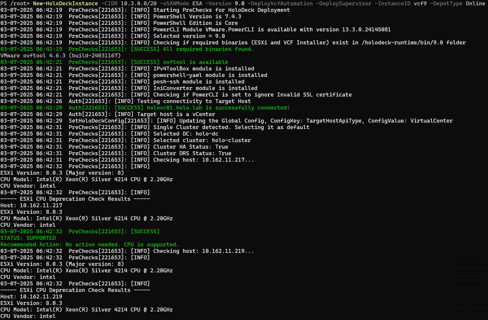

This is an interactive section during the pre-checks where you select the desired datastore to use for Holodeck deployment:


Choose your desired trunk port group to deploy the nested VMs (ESX and VCF Installer/Cloud Builder) on:


Pre-Checks are completed. If going through the online route, you need to provide the broadcom support site token:


Networking setup completed on Holorouter:


Deployment initiated:


Nested ESX hosts getting built:


VCF Installer being deployed:


VCF bundles being downloaded:


Management Domain deployment initiated through VCF Installer:

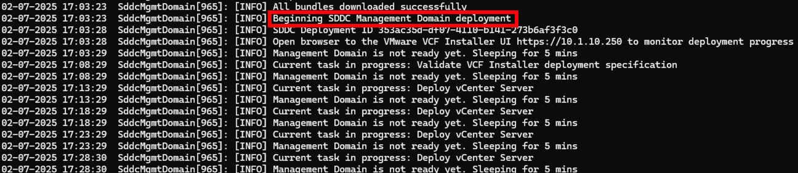

Management Domain deployment completed and Workload Domain deployment initiated:


Deployment completed successfully:


### Offline Depot method

For setting up the offline depot, check out the [Offline Depot Page](offline_depot.md).

The procedure is similar to online depot except instead of passing the build token, customer needs to provide the details of the offline depot interactively:


## Post Deployment

Once Holodeck is deployed, you can access the VCF components on your browser, assuming you have opted for default DNS domain (local based on your networking setup or webtop):

|                   | **Appliance**                  | FQDN                                                                                                                        | **Username**                                                                        | **Password**         |
|-------------------|--------------------------------|-----------------------------------------------------------------------------------------------------------------------------|-------------------------------------------------------------------------------------|----------------------|
| Management Domain |                                |                                                                                                                             |                                                                                     |                      |
|                   | VCF Installer or Cloud Builder | https://vcfinstaller-a.site-a.vcf.lab                                                                                       | admin@local for VCF Installer admin for Cloud Builder                               | VMware123!VMware123! |
|                   | VCF Operations                 | https://ops-a.site-a.vcf.lab/                                                                                               | admin or admin@local                                                                | VMware123!VMware123! |
|                   | VCF Automation                 | https://auto-a.site-a.vcf.lab/  Organization: system                                                                        | admin                                                                               | VMware123!VMware123! |
|                   | ESX                            | https://esx-01a.site-a.vcf.lab https://esx-02a.site-a.vcf.lab https://esx-03a.site-a.vcf.lab https://esx-04a.site-a.vcf.lab | root                                                                                | VMware123!VMware123! |
|                   | Management vCenter             | https://vc-mgmt-a.site-a.vcf.lab/                                                                                           | administrator@vsphere.local                                                         | VMware123!VMware123! |
|                   | SDDC-Manager                   | https://sddcmanager-a.site-a.vcf.lab/                                                                                       | administrator@vsphere.local                                                         | VMware123!VMware123! |
|                   | Management NSX                 | https://nsx-mgmt-a.site-a.vcf.lab                                                                                           | admin                                                                               | VMware123!VMware123! |
| Workload Domain   |                                |                                                                                                                             |                                                                                     |                      |
|                   | Workload vCenter               | https://vc-wld01-a.site-a.vcf.lab/                                                                                          | administrator@wld.sso if Isolated SSO enabled administrator@vsphere.local otherwise | VMware123!VMware123! |
|                   | Workload NSX                   | https://nsx-wld01-a.site-a.vcf.lab/                                                                                         | admin                                                                               | VMware123!VMware123! |
|                   | ESX                            | https://esx-05a.site-a.vcf.lab https://esx-06a.site-a.vcf.lab https://esx-07a.site-a.vcf.lab                                | root                                                                                | VMware123!VMware123! |

The above table has been generated for Site A. If you have deployed Site B, replace "site-a" in the FQDN with "site-b". For example, Management vCenter for Site A is https://vc-mgmt-a.site-a.vcf.lab/ and Management vCenter for Site B is https://vc-mgmt-a.site-b.vcf.lab/

## How To

### Start and Stop Holodeck Instance

There may be situations where you have already deployed Holodeck but need the resources for another operation. In that case, we provide cmdlets to power off Holodeck and power it back on as well.

For powering off Holodeck:

```
Stop-HoloDeckInstance [-InstanceID] <string> [-Force]
```

Stop-HoloDeckInstance asks for confirmation which can be bypassed by using the -Force parameter.


For powering on Holodeck:

```
Start-HoloDeckInstance [-InstanceID] <string> [-Force]
```

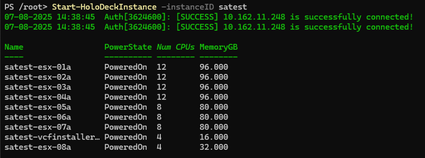

### Create new nested ESX hosts

You can dynamically add new ESX hosts to an existing site using the New-HoloDeckESXiNodes cmdlet.

```
New-HoloDeckESXiNodes -Nodes <No. of Nodes> -CPU <No. of vCPU> -MemoryInGb <Memory in GB> -Site <'a' or 'b'> -vSANMode <'ESA' or 'OSA'>
```


### Remove nested VCF Instance

To remove a HoloDeck Instance, run:

```
Remove-HoloDeckInstance [-ResetHoloRouter]
```

Remove-HoloDeckInstance will delete al the nested ESX hosts and VCF Installer/Cloud Builder VM associated to a specific instance.

-ResetHoloRouter will remove the networking configuration setup for the nested VCF instance. When you run New-HoloDeckInstance, the networking is configured again. This involves an automatic reboot of the Holorouter.

### Get subnets in Holodeck

You can list all the subnets that have been configured or reserved for HoloDeck. You can also get information about specific subnets by specifying the name, VLAN ID, Subnet range, and Gateway IP.

```
Get-HoloDeckSubnet [-Name <string>] [-vlanID <string>] [-Subnet <string>] [-Gateway <string>] [-Site <string>] [<CommonParameters>]

For e.g.:
For Site 'a':
Get-HoloDeckSubnet -Site a | ft -AutoSize

For Site 'b':
Get-HoloDeckSubnet -Site b | ft -AutoSize

Get-HoloDeckSubnet -Site a -Name Untagged-HOL

Get-HoloDeckSubnet -Site b -vlanID 50

Get-HoloDeckSubnet -Site a -Gateway 10.1.1.1

Get-HoloDeckSubnet -Site a -Subnet 10.1.2.0/25
```

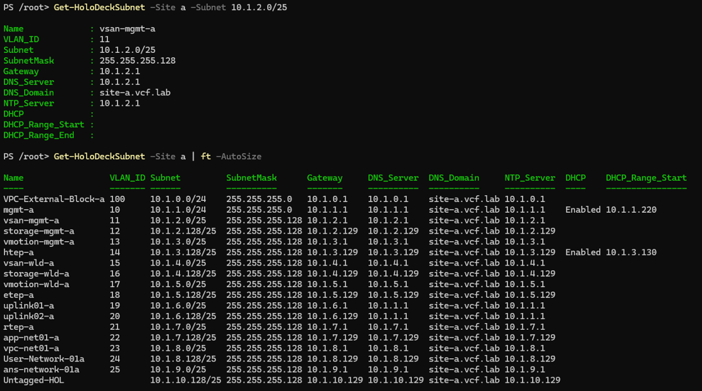

### Get appliance details

You can list all the IP-Hostname entries generated by the Network Manager for HoloDeck. You can also get information about specific IP-Hostname mappings by specifying the IP, hostname, and FQDN.

```
Get-HoloDeckAppNetwork [-Hostname <string>] [-IP <string>] [-FQDN <string>] [-Site <string>] [<CommonParameters>]

For e.g.:
For Site 'a':
Get-HoloDeckAppNetwork -Site a

For Site 'b':
Get-HoloDeckAppNetwork -Site b

Get-HoloDeckAppNetwork -Site a -Hostname router

Get-HoloDeckAppNetwork -Site a -IP 10.1.1.10

Get-HoloDeckAppNetwork -Site a -FQDN esx-01a.site-a.vcf.lab
```


### Get BGP configuration 

You can list the BGP configuration generated by the Network Manager for HoloDeck. 

```
Get-HoloDeckBGPConfig [-Site <string>] [<CommonParameters>]

For e.g.:
For Site 'a':
Get-HoloDeckBGPConfig -Site a

For Site 'b':
Get-HoloDeckBGPConfig -Site b
```


### Get DNS entries

You can list all the DNS entries configured in the DNS service in HoloRouter. You can also get information about a specific DNS entry by specifying its IP or FQDN. 

```
Get-HoloDeckDNSConfig [-IP <string>] [-FQDN <string>] [<CommonParameters>]

For e.g.:
Get-HoloDeckDNSConfig

Get-HoloDeckDNSConfig -IP 10.1.1.1

Get-HoloDeckDNSConfig -FQDN esx-02a.site-a.vcf.lab 
```

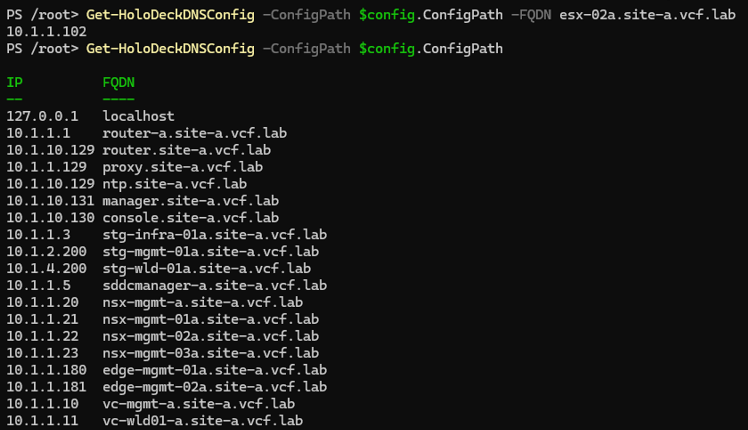

### Add or Update DNS entries

You can configure additional DNS entries to the DNS service in HoloRouter. To do that, use the Set-HoloDeckDNSConfig cmdlet. Note that you must specify the DNS entry in single quotes ('<dns_entry>').

```
Set-HoloDeckDNSConfig -DNSRecord <string> [<CommonParameters>]

For e.g., to create a DNS entry for '10.1.1.201 harbor.site-a.vcf.lab', you would run -
Set-HoloDeckDNSConfig -DNSRecord '10.1.1.201 harbor.site-a.vcf.lab'
```


You can also replace the DNS entries existing in the DNS service in HoloRouter. You will still use the Set-HoloDeckDNSConfig but specify different parameters. Note that the DNS entries to be searched and replaced must be specified in single quotes ('<dns_entry>').

```
Set-HoloDeckDNSConfig -SearchDNSRecord <string> -ReplaceDNSRecord <string> -Update [<CommonParameters>]

For e.g., to replace the DNS entry '10.1.1.201 harbor.site-a.vcf.lab' with '10.1.1.210 harbor.site-a.vcf.lab', you would run -
Set-HoloDeckDNSConfig -SearchDNSRecord '10.1.1.201 harbor.site-a.vcf.lab' -ReplaceDNSRecord '10.1.1.210 harbor.site-a.vcf.lab' -Update
```


### Remove DNS entries

You can remove the DNS entries from the DNS service in HoloRouter. To do that, use Remove-HoloDeckDNSConfig cmdlet. You must specify the DNS entry in single quotes ('<dns_entry>').

```
Remove-HoloDeckDNSConfig -DNSRecord <string>  [<CommonParameters>]

For e.g., to remove the DNS entry '10.1.1.210 harbor.site-a.vcf.lab', you would run -
Remove-HoloDeckDNSConfig -DNSRecord '10.1.1.210 harbor.site-a.vcf.lab'
```


## Troubleshooting

Refer to the [Troubleshooting section](faq.md#troubleshooting) on the [FAQ page](faq.md) for more details.
