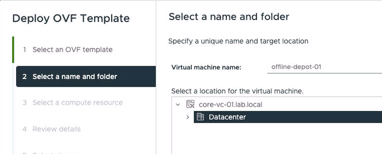
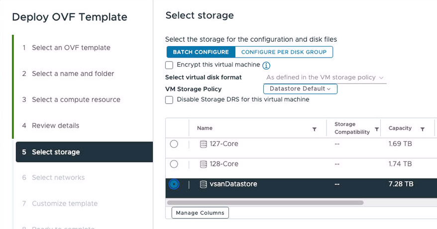
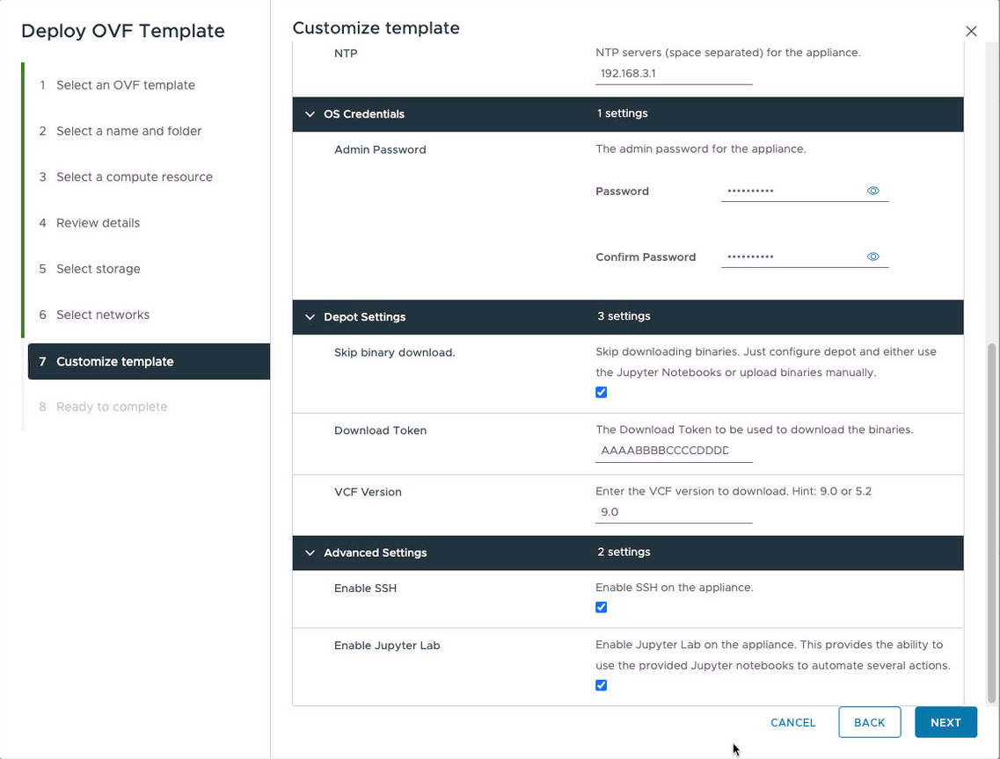
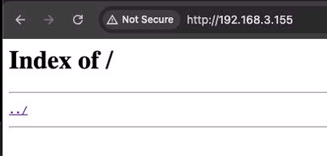
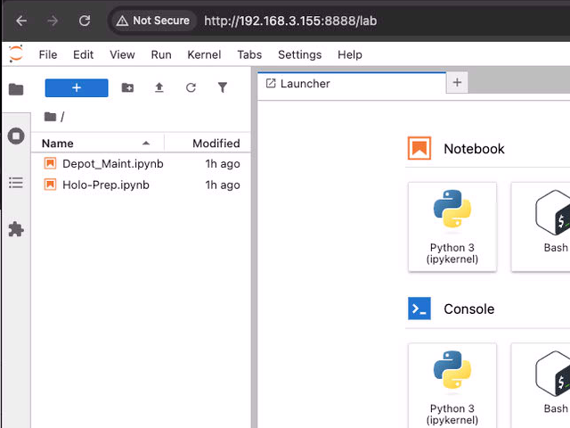
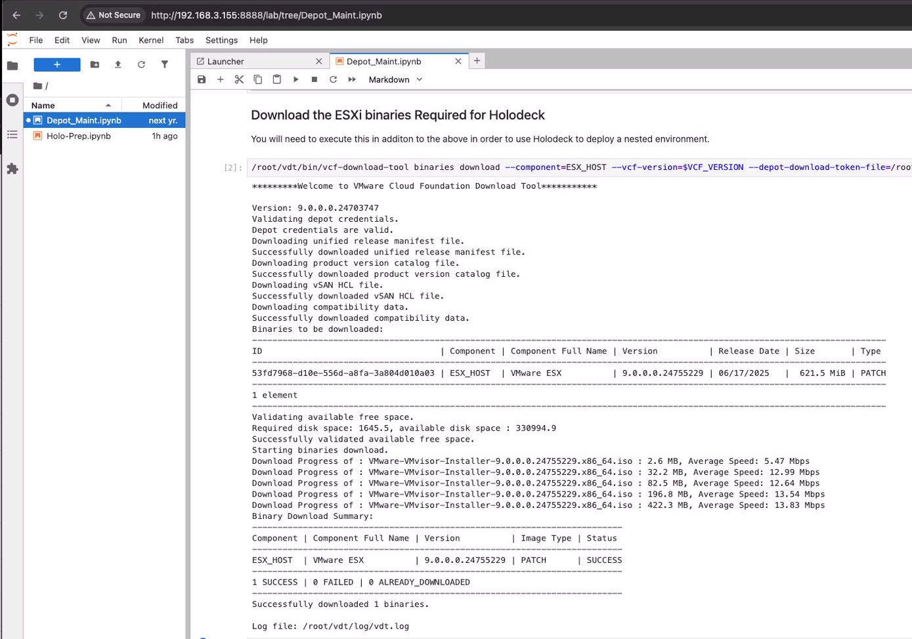

<h1 style="text-align: center;"><strong>Offline Depot</strong></h1>

### Overview

The Offline Depot Appliance (ODA) is intended to help with the creation and maintenance of a VCF offline depot. A offline depot provides software for installation or updates to one or more VMware Cloud Foundation instances.

An offline depot is not a requirement for VMware Cloud Foundation, as it has the out-of-the-box ability to leverage a online depot. As the online depot is managed by Broadcom, it has all the binaries accessible for a customer's entitlements. In contrast, a offline depot is managed by a customer and can be configured to only have specific binaries (if desired). 

However, a offline depot has several advantages:
- It can provide organizations with ability to use a offline depot in environments where external network connectivity is restricted or unavailable.
- It can provide faster download and installation speeds, as the offline depot would be local to the organization. 
- It allows organizations to curate the binaries that they wish to make available to their VCF Instances.

In addition, this Offline Depot Appliance provides a couple of additional features over and beyond simple offline depot:

- It supports Holodeck
Holodeck is a tool that automates the deployment of a virtualized VMware Cloud Foundation instance. This can be helpful to organizations in testing integrations, APIs, and general functionality as it requires a significantly reduced physical hardware footprint (and cost). 

- It provides for easy management of the depot
The user can optionally enable a Jupyter Lab instance on the depot. In doing so, a couple of Jupyter notebooks are included which help perform various tasks related to depot maintenance and Holodeck integration. 
### Obtaining a Download Token

In order to leverage the ODA to download and populate the depot with the required binaries, you will need a download token. 

You can obtain a download token by following the instructions described in this [Broadcom KnowledgeBase Article](https://knowledge.broadcom.com/external/article/390098).
### Deployment Options if Using Holodeck

If you are using Holodeck, you basically have two options for where to deploy the ODA: 

- It can be deployed on the management network
- It can be deployed on the isolated network.

The recommended deployment method is to install the ODA on the management network. This allows the ODA to have network access to download the bits as well as to allow the AI chatbot to function. 

With this type of deployment, you can utilize the included Jupyter notebooks to perform several of the tasks needed when using Holodeck. This includes things like copying the binaries to the Holorouter as well as performing common tasks, such as getting information from the HoloDeck configuration.  

The other method is to install the ODA on the isolated network. Although this works, there are a few more steps required.

As the isolated network doesn't have network access until the Holorouter is all configured with BGP and DNS, you can not download the binaries to the ODA.

This means that you would have to manually download and copy the SDDC Manager and ESXi binaries to the Holorouter and start the Holorouter deployment.

Once the Holorouter is up and online, then it can forward requests out to the internet and this allows you to start performing the binary downloads directly to the ODA as the ODA will now have internet access.

### Deploying the Offline Depot Appliance

To deploy the appliance, simply deploy the OVA on your vCenter Server like you would normally do.

<figure markdown="span">
    
</figure>

Next, You will provide the VM a name and specify the location where it will be deployed to:

<figure markdown="span">
    
</figure>

Next, you will select the compute resource to deploy the VM to. Note that you can check the box so that the VM is automatically started after it is finished being imported. If you wanted to watch the first boot process, then you can leave this unselected and manually power on the VM.

<figure markdown="span">
    
</figure>

Next, you see the review page - Just click Next to continue.

<figure markdown="span">
    
</figure>

Next, you will need to select the appropriate storage. Ensure that the storage has enough space for your needs. 

<figure markdown="span">
    
</figure>

At the next screen, you can select the network that you want to deploy the ODA to. Please see the above section that talks about the different ways you could deploy the appliance. In short though, it is recommended that you put the appliance on the management network.

<figure markdown="span">
    
</figure>

Now you've gotten to the point where you will need to specify various networking attributes, such as the host name, IP address, and Net Mask. Use the values required for your environment.

<figure markdown="span">
    
</figure>

The next section of attributes are used to set the password for the admin user. This is the user account that you will use to SSH into the appliance.

After this, you can select some options specific to the depot configuration. 

- Skip Binary Download
If you select this, the appliance will not attempt to automatically download the required VCF binaries when it powers on. This is very handy if you do not have your download token at the time you are installing the appliance. 

After the appliance is deployed, you can either manually populate the depot or you can utilize the automation provided in the included Jupyter Notebooks to help you populate the depot. 

- Download Token
You will need to provide this in order to the appliance to attempt to automatically download the VCF binaries. If you do not provide this, then the appliance will attempt to download the required bits and then fail after timing out. 

As in the case if you selected to skip the binary download, you can always manually populate the depot or use the Jupyter Notebooks later.

- VCF Version
This specifies the VCF version you wish to have the appliance download the binaries for. For VCF 9, simply enter '9.0' here.

The Advanced section provides you the ability to enable SSH to the appliance as well as the option to enable the Jupyter Lab server. It is highly recommended that you enable the Jupyter Lab server and this option will be checked by default. 

<figure markdown="span">
    
</figure>

### Initial Boot

After you deploy the appliance, you'll want to power it on. Note that the first time you power it on, it will perform some configuration steps and then reboot itself. These configuration steps will only occur the first time you boot the VM.

Please wait until the second boot completes until trying to use the appliance.
### Accessing the Appliance Web Server

With the appliance online, use a web browser and go to:

`http://<ODA_IP>`

You should see this if you selected the option to skip the automatic download of the binaries or if the appliance had some issue trying to download the binaries:

<figure markdown="span">
    
</figure>

This indicates that no binaries have been put into place on the depot. After you download binaries (see below) then this will be populated.

### Accessing the Jupyter Lab Server

You can also access the Jupyter Lab server (if you enabled it) by using the following URL: 

http://<ODA_IP>:8888

<figure markdown="span">
    
</figure>

Here, you will see two Jupyter notebooks that can assist you in performing a variety of tasks. 

### Accessing the VCF Product Documentation

To make things a bit easier for people, copies of the VCF 5.2 and 9.0 product documentation is included on the appliance under /var/www/docs

### Logging into the ODA

You can login to the ODA appliance as the user **admin** with the password you set at boot.

If you need to become root, simply use sudo

```
sudo su
```
### Populating the binaries

There are two main methods you can do this by. These are listed below.

#### Option One: Leverage the Jupyter Notebook

This is the preferred method, as it makes things a bit easier. Simply access the Depot Maintenance Jupyter Notebook and go to the section about downloading the binaries and follow the directions.

<figure markdown="span">
    
</figure>

Please note that the Jupyter Notebook will display the output of the command cell executed (if there is any). For example, if you ran the cell to download the ESXi binaries for Holodeck, you would see something similar to this:

<figure markdown="span">
    
</figure>

It's important to note that you can make these Jupyter Notebooks specific to your environment by modifying the commands or adding more.
#### Option Two: Manually Use the VCF Download Tool

The VCF Download Tool (VDT) is also included with this version of the ODA under the /root/vdt/bin directory.

The VDT tool replaces the Offline Bundle Transfer Utility (OBTU) tool previously used. It also has some extensive help that you can access by using the -help argument.
#### Directory Structure and Permissions

If you populate the binaries manually, then you need to ensure the files are in the proper location with the proper permissions. 

Again, to assist you with this, you can leverage the Jupyter Notebooks or you can manually execute the commands:

<figure markdown="span">
    
</figure>

Failure to set the permissions properly will result in the inability to download the files from the depot.

The directory structure varies depending on what version of VCF you populated the depot with. For VCF 9.0, you will see that under the root directory, you'll have a directory called PROD. Under this, you'll see a directory called COMP and here you will see all the various binaries used.

You will also see a directory for metadata and vsan under /PROD as well. If you are populating the binaries manually, ensure these files exist.

<figure markdown="span">
    
</figure>

### Caveats

There are a few things that you should be aware when using this depot:

- The depot does not use HTTPS. Doing so would require the generation and maintenance of certs. This just adds complexity to everything that isn't needed for most lab environments. 
	- You will need to change the application-prod.properties file attributes to allow for the use of http.
	- You will likely see a error in the VCF Installer UI saying that you have to use HTTPS. If you've made all the changes, then you can ignore this warning.
	- If you are using Holodeck, it automatically will make the required changes for you.

- The disk size is only about 300g for the appliance. Depending on what you are doing, you might need more space. If this is the case, see the section below on how to add more space.

- There is a known issue with the depot appliance when you deploy to a ESXi host directly. In this case, the Jupyter Labs server may not be able to be configured. The depot will still function, regardless.  To work around this, deploy the appliance to a vCenter instance.

### How to Expand the Storage

You might need to expand the filesystem of the depot as you populate it with more binaries. 

These procedures are documented in the included Jupyter Notebook. This allows you to execute them directly from there. However, if you chose not to install the Jupyter Notebooks, the instructions are duplicated here.

First, you need to increase the size of the physical disk. To do this, simply edit the size of the disk for the VM and increase it to what will suit your needs. It will support up to 5.9TB in size.

Next, we need to make sure the OS is aware of the space increase:
```
echo 1 > /sys/block/sda/device/rescan
```
Finally, we will execute this command in order to resize the partition
```
printf 'yes\n100%%\n' | parted /dev/sda resizepart 2 ---pretend-input-tty
```
You can verify that the partition has been resized by using the following command:
```
parted -s -a opt /dev/sda "print free"
```

<figure markdown="span">
    
</figure>

Next, you need to expand the filesystem in order to take advantage of the new partition space by using a command like:
```
resize2fs /dev/sda2
```
