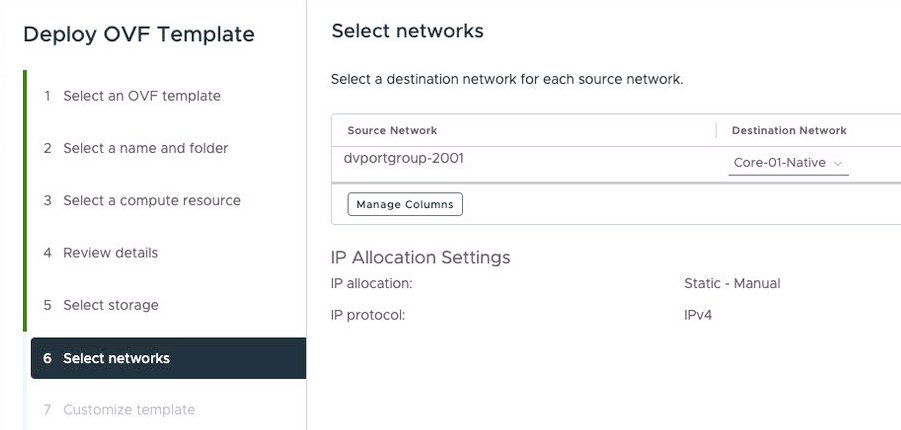
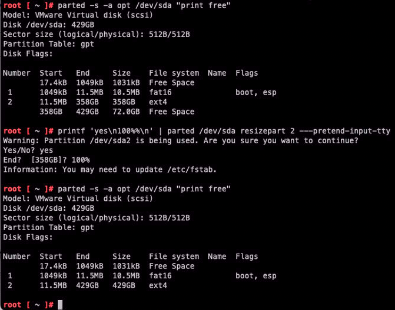

<h1 style="text-align: center;"><strong>Offline Depot</strong></h1>

### Overview

The Offline Depot Appliance (ODA) facilitates the creation and maintenance of a VMware Cloud Foundation (VCF) offline depot. An offline depot stores software for VCF installation or updates.

While VCF has built-in capabilities to use an online depot managed by Broadcom, an offline depot offers several key advantages:

- **Restricted Environments**: Enables VCF deployments in environments with limited or no external network connectivity. 
- **Faster Speeds**: Provides quicker download and installation speeds due to local proximity. 
- **Content Curation**: Allows organizations to control and curate the VCF binaries available to their instances. 

Additionally, the ODA provides features beyond basic offline depot functionality:

- **Holodeck Support**: Integrates with Holodeck for automated deployment of virtualized VCF instances, reducing physical hardware requirements and costs.
- **Simplified Management**: Optionally includes a Jupyter Lab instance with notebooks for streamlined depot maintenance and Holodeck integration tasks.

### Obtaining a Download Token

In order to leverage the ODA to download and populate the depot with the required binaries, you will need a download token. 

You can obtain a download token by following the instructions described in this [Broadcom KnowledgeBase Article](https://knowledge.broadcom.com/external/article/390098).
### Deployment Options if Using Holodeck

When using Holodeck, there are two primary options for deploying the ODA:

- **Management Network Deployment (Recommended)**

  Deploying the ODA on the management network is the recommended method. This configuration provides the ODA with direct network access to download binaries and enables full functionality, including the AI chatbot. Additionally, the integrated Jupyter notebooks can be leveraged to streamline tasks such as copying binaries to the Holorouter and accessing HoloDeck configuration information.

- **Isolated Network Deployment**

  While deploying the ODA on an isolated network is possible, it requires additional steps. Initially, the isolated network lacks external connectivity until the Holorouter is fully configured with BGP and DNS. This means binaries cannot be directly downloaded to the ODA. As a workaround, you must manually download and copy the SDDC Manager and ESX binaries to the Holorouter before initiating the Holorouter deployment. Once the Holorouter is online and configured, it can forward internet requests, enabling direct binary downloads to the ODA.

### Deploying the Offline Depot Appliance

<ol>
    <li>
        To deploy the appliance, simply deploy the OVA on your vCenter Server like you would normally do.
        <figure markdown="span">
            
        </figure>
        <br>
    </li>
    <li>
        Next, provide a name for the VM and specify its deployment location:
        <figure markdown="span">
            
        </figure>
        <br>
    </li>
    <li>
        Then, select the compute resource for the VM. You can choose to automatically start the VM after import by checking the box; otherwise, you can power it on manually to observe the first boot process.
        <figure markdown="span">
            
        </figure>
        <br>
    </li>
    <li>
        Review the settings and proceed by clicking Next.
        <figure markdown="span">
            
        </figure>
        <br>
    </li>
    <li>
        Next, select appropriate storage with sufficient capacity for your needs.
        <figure markdown="span">
            
        </figure>
        <br>
    </li>
    <li>
        On the next screen, select the network for ODA deployment. As discussed in the previous section, it is recommended to deploy the appliance on the management network.
        <figure markdown="span">
            
        </figure>
        <br>
    </li>
    <li>
        Now, specify the networking attributes, including hostname, IP address, and netmask, according to your environment's requirements.
        <figure markdown="span">
            
        </figure>
        <br>
    </li>
</ol>

The subsequent section allows you to set the password for the admin user, which is used for SSH access to the appliance.

Following this, configure the depot-specific options:

- **Skip Binary Download:**
  Selecting this option prevents the appliance from automatically downloading required VCF binaries during power-on, which is useful if a download token is not available at installation. The depot can be populated manually or using the included Jupyter Notebooks after deployment.

- **Download Token:**
  Provide a download token to enable automatic download of VCF binaries upon appliance power-on. If no token is provided, the download attempt will time out. Similar to skipping the download, manual population or Jupyter Notebooks can be used later.

- **VCF Version:**
  Specify the target VCF version for binary downloads (e.g., '9.0' for VCF 9). The Advanced section offers options to enable SSH and the Jupyter Lab server. Enabling the Jupyter Lab server is highly recommended and is selected by default.

<figure markdown="span">
    
</figure>

### Initial Boot

After you deploy the appliance, you'll want to power it on. Note that the first time you power it on, it will perform some configuration steps and then reboot itself. These configuration steps will only occur the first time you boot the VM.

Please wait until the second boot completes until trying to use the appliance.
### Accessing the Appliance Web Server

With the appliance online, use a web browser and go to:

`http://<ODA_IP>`

You should see this if you selected the option to skip the automatic download of the binaries or if the appliance had some issue trying to download the binaries:

<figure markdown="span">
    
</figure>

This indicates that no binaries have been put into place on the depot. After you download binaries (see below) then this will be populated.

### Accessing the Jupyter Lab Server

You can also access the Jupyter Lab server (if you enabled it) by using the following URL: 

http://<ODA_IP>:8888

<figure markdown="span">
    
</figure>

Here, you will see two Jupyter notebooks that can assist you in performing a variety of tasks. 

### Accessing the VCF Product Documentation

To make things a bit easier for people, copies of the VCF 5.2 and 9.0 product documentation is included on the appliance under /var/www/docs

### Logging into the ODA

You can login to the ODA appliance as the user **admin** with the password you set at boot.

If you need to become root, simply use sudo

```
sudo su
```
### Populating the binaries

There are two main methods you can do this by. These are listed below.

#### Option One: Leverage the Jupyter Notebook

This is the preferred method, as it makes things a bit easier. Simply access the Depot Maintenance Jupyter Notebook and go to the section about downloading the binaries and follow the directions.

<figure markdown="span">
    
</figure>

Please note that the Jupyter Notebook will display the output of the command cell executed (if there is any). For example, if you ran the cell to download the ESX binaries for Holodeck, you would see something similar to this:

<figure markdown="span">
    
</figure>

It's important to note that you can make these Jupyter Notebooks specific to your environment by modifying the commands or adding more.
#### Option Two: Manually Use the VCF Download Tool

The VCF Download Tool (VDT) is also included with this version of the ODA under the /root/vdt/bin directory.

The VDT tool replaces the Offline Bundle Transfer Utility (OBTU) tool previously used. It also has some extensive help that you can access by using the -help argument.
#### Directory Structure and Permissions

If you populate the binaries manually, then you need to ensure the files are in the proper location with the proper permissions. 

Again, to assist you with this, you can leverage the Jupyter Notebooks or you can manually execute the commands:

<figure markdown="span">
    
</figure>

Failure to set the permissions properly will result in the inability to download the files from the depot.

The directory structure varies depending on what version of VCF you populated the depot with. For VCF 9.0, you will see that under the root directory, you'll have a directory called PROD. Under this, you'll see a directory called COMP and here you will see all the various binaries used.

You will also see a directory for metadata and vsan under /PROD as well. If you are populating the binaries manually, ensure these files exist.

<figure markdown="span">
    
</figure>

### Caveats

Consider the following important points when using the offline depot:

- **HTTPS Support**: The depot does not currently support HTTPS to reduce complexity related to certificate generation and maintenance. 
  - **Workaround**: You will need to modify `application-prod.properties` to allow HTTP. The VCF Installer UI may display a warning about HTTPS; this can be ignored if the necessary changes have been applied. Holodeck automates these modifications.

- **Disk Space**: The appliance is provisioned with approximately 300GB of disk space. Depending on your use case and the number of binaries, additional storage may be required. Refer to the "How to Expand the Storage" section for instructions on increasing disk capacity.

- **Jupyter Lab on ESX**: A known issue exists where the Jupyter Lab server may not configure correctly when the depot appliance is deployed directly to an ESX host. The depot functionality remains unaffected. 
  - **Recommendation**: To avoid this issue, deploy the appliance to a vCenter instance.

### How to Expand the Storage

You might need to expand the filesystem of the depot as you populate it with more binaries. 

These procedures are documented in the included Jupyter Notebook. This allows you to execute them directly from there. However, if you chose not to install the Jupyter Notebooks, the instructions are duplicated here.

First, you need to increase the size of the physical disk. To do this, simply edit the size of the disk for the VM and increase it to what will suit your needs. It will support up to 5.9TB in size.

Next, we need to make sure the OS is aware of the space increase:
```
echo 1 > /sys/block/sda/device/rescan
```
Finally, we will execute this command in order to resize the partition
```
printf 'yes\n100%%\n' | parted /dev/sda resizepart 2 ---pretend-input-tty
```
You can verify that the partition has been resized by using the following command:
```
parted -s -a opt /dev/sda "print free"
```

<figure markdown="span">
    
</figure>

Next, you need to expand the filesystem in order to take advantage of the new partition space by using a command like:
```
resize2fs /dev/sda2
```
